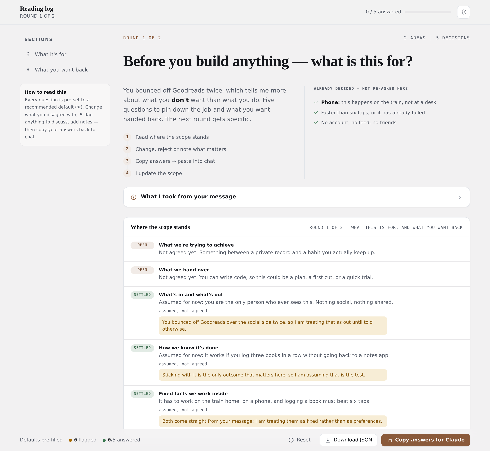
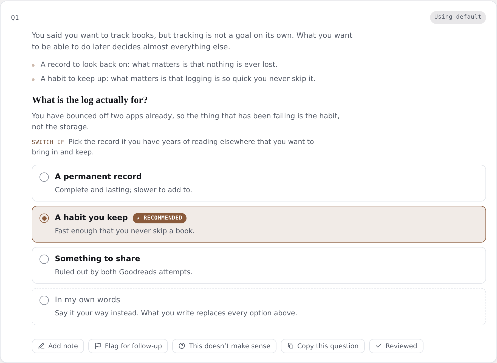

# megascope

[](https://github.com/deejaymorgan/skill-megascope/actions/workflows/test.yml)

**Interactive project scoping for Claude Code.** Point it at a fuzzy request and it drives the project
to an **agreed, checkable scope** — then to a kick-off brief a fresh agent session can execute.

It works in **short rounds**. Each round is a polished, theme-aware interactive document where every
decision is pre-set to a researched recommendation. You review, override, reject and flag;
click **Copy answers for Claude**; paste back. The next round is written from your answers.

What gets handed over is itself a scoping decision — a build plan, a feature spec, an experiment, or
something else. The skill infers which, and asks when the goal doesn't make it obvious.

<picture>
  <source media="(prefers-color-scheme: dark)" srcset="docs/images/document-dark.png">
  
</picture>

<sup>Round 1 of the worked example in [`examples/reading-log/`](examples/reading-log/) — generated from
[a 200-line data file](examples/reading-log/round-1.data.json), like every round.</sup>

## Install

```
/plugin marketplace add deejaymorgan/skill-megascope
/plugin install megascope@skill-megascope
```

Plugins load at session start, so open a **new** session, then invoke `/megascope` and describe the
project you want to scope.

<details>
<summary>Install without a marketplace</summary>

The plugin is self-contained in `skills/megascope/`, so a symlink into your personal skills directory
works too — Claude Code loads any folder there containing `.claude-plugin/plugin.json` as a plugin,
discovered in place:

```bash
git clone https://github.com/deejaymorgan/skill-megascope
ln -s "$PWD/skill-megascope/skills/megascope" ~/.claude/skills/megascope
```

This is also what the development workflow uses, so edits are live in the next session with no
reinstall. See [CONTRIBUTING.md](CONTRIBUTING.md).
</details>

## What makes it work

Every question looks like this — already answered, with the reasoning attached and two ways out:

<picture>
  <source media="(prefers-color-scheme: dark)" srcset="docs/images/question-dark.png">
  
</picture>

- **Recommendation-first, not a blank form** — every question ships pre-answered with a ★ default and
  a one-line *why* that names the tradeoff, and often when the runner-up would win. You review, you
  don't author.
- **Defaults are earned by research** — concrete, grounded options, not generic filler.
- **Nobody gets boxed in** — every question also offers *in my own words* and *this doesn't make
  sense*, added by the engine so a run can't forget them. A rejection opens a dialogue; it never
  counts as an answer.
- **A flag is a bookmark, not an objection** — copy a question out on its own, ask about it elsewhere,
  come back. The answer still stands and the round doesn't wait.
- **A clean, structured export** closes the human→Claude loop — the tool parses it back, so a later
  round's claims are checked against what you actually said.
- **Readiness is a check, not a self-report** — five scope slots, each settled only by evidence that
  actually resolves it. The loop ends when the tool refuses to build another round, not when Claude
  decides it's done.
- **Constraints stated up front** — facts already fixed are listed under "Already decided — not
  re-asked here", so no round burns a question on them.

## How a run works

0. **Intake** — pin the subject, the goal, and the facts already fixed; 2–4 clarifying questions, only
   where the answer changes what gets researched.
1. **Round 1** — the goal, and what kind of work this is. Research is deliberately light here: a
   first round must not make you wait.
2. **Round-trip** — you fill it in and paste the export back. It's saved verbatim; later rounds are
   checked against it.
3. **Round N** — written from your answers, scoping the next layer. Research is sized to what your
   last answers actually opened up. `build` refuses a round that advances nothing, asks about
   something settled, or leaves an open slot untargeted.
4. **Close** — when every slot is settled, `build` refuses and `ready` checks its six closing
   conditions. Then
   a scope summary you approve, and a **kick-off brief** a fresh session can act on with no other
   context.

[`examples/reading-log/`](examples/reading-log/) is a complete worked scope — the user's original
request, both rounds of data and answers, the settled scope, and the kick-off brief that came out.

## The idea: one engine, data per run

The scoping document is produced by a **data-driven engine** — a single static, self-contained,
theme-aware HTML shell ([`skills/megascope/assets/engine.html`](skills/megascope/assets/engine.html))
fed a per-run **questions-JSON**. Each run generates *only the JSON*; the engine is never edited.
That's the efficiency win, and the thing the skill protects.

The engine renders everything from data — header, intro, the already-decided list, a collapsible
context panel, sectioned recommendation-first question cards, live counts in a single action bar,
sticky nav with scroll-spy, a clean **Copy answers for Claude** export, JSON download, `localStorage`
persistence, and full light/dark theming. It's offline and CSP-safe, so the same file works as a
standalone `.html` **and** as a published Artifact.

## Repo layout

```
skill-megascope/
├── .claude-plugin/marketplace.json    # the marketplace catalogue (this repo hosts one plugin)
├── skills/megascope/                  # ← the plugin: everything shipped to users lives here
│   ├── .claude-plugin/plugin.json     # plugin manifest — name, version, metadata
│   ├── SKILL.md                       # the skill: trigger + the round loop
│   ├── assets/
│   │   ├── engine.html                # the static, data-driven shell (never edited per run)
│   │   ├── megascope.mjs              # validate · build · ready — zero deps, ships with the plugin
│   │   └── schema.json                # questions-JSON JSON Schema
│   └── references/                    # playbook
│       ├── rounds.md                  #   the five slots, round sizing, the close
│       ├── engine-data.md             #   the exact data contract
│       ├── writing-questions.md       #   what the schema can't enforce
│       ├── research-fanout.md         #   per-round research patterns
│       └── theming.md                 #   subject-grounded accent + theme tokens
├── examples/reading-log/              # one worked two-round scope, request → kick-off brief
├── scripts/
│   ├── build-doc.mjs                  # inject a data.json into the shell → standalone HTML
│   ├── inject.mjs                     # the one injection operation
│   ├── dev.mjs                        # live preview: watch engine + sample data → scratch/preview.html
│   ├── mega.sh                        # flip the deployed plugin between the prod/dev worktrees
│   └── release.sh                     # cut a release: test, bump both manifests, merge, tag, push
├── tests/                             # see CONTRIBUTING.md for what each suite asserts
├── CLAUDE.md                          # repo invariants, for Claude sessions working here
├── CONTRIBUTING.md                    # development workflow and release process
└── LICENSE
```

## Build & test

```bash
npm install            # ajv + jsdom (dev only; the shipped plugin has zero dependencies)
npm test               # schema + invalid corpus + readiness + headless render + docs + manifests
npm run dev            # live engine preview — watch + rebuild scratch/preview.html on save
```

Build any round from its data file — this is what a run actually calls, and it **refuses to write** an
invalid round:

```bash
node skills/megascope/assets/megascope.mjs build path/to/round-1.data.json path/to/round-1.html
node skills/megascope/assets/megascope.mjs ready docs/scoping/my-project/
```

Development, dogfooding and releases are covered in [CONTRIBUTING.md](CONTRIBUTING.md).

## Authoring a questions-JSON

[`references/engine-data.md`](skills/megascope/references/engine-data.md) is the field-by-field
contract, [`references/rounds.md`](skills/megascope/references/rounds.md) covers the five slots and the
close, and [`references/writing-questions.md`](skills/megascope/references/writing-questions.md) covers
what the schema can't enforce.

## License

MIT © Daniel Morgan. See [LICENSE](LICENSE).
